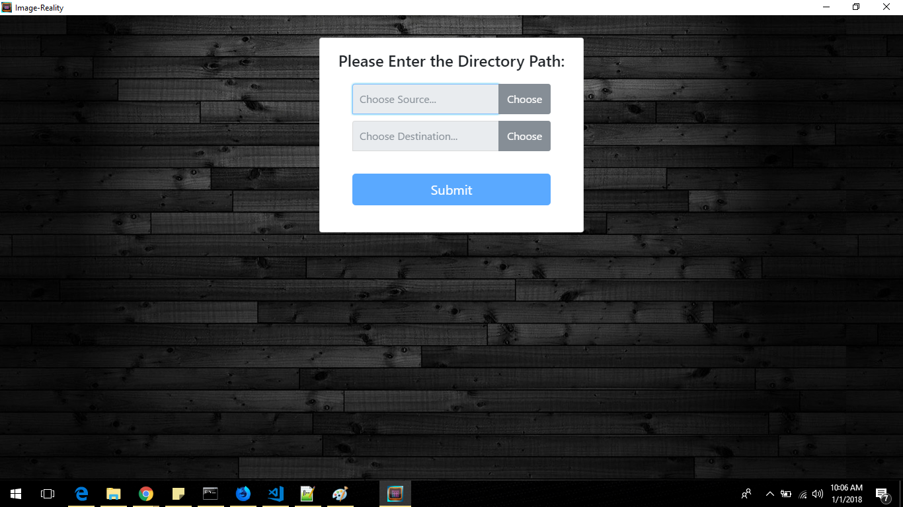
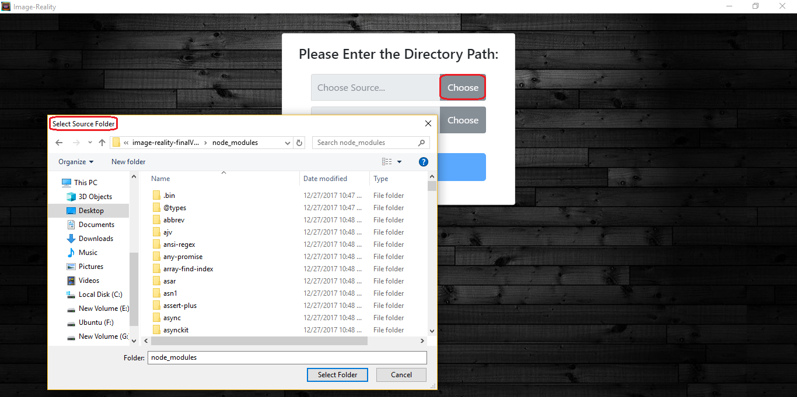
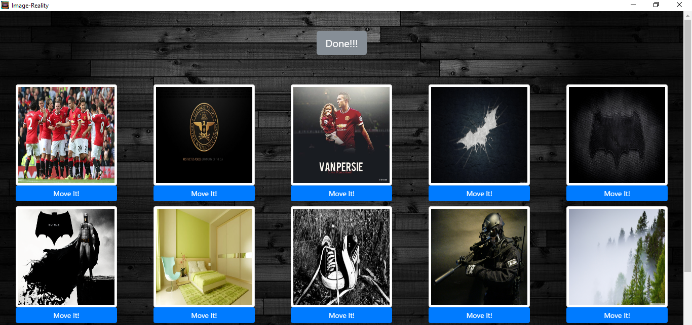

# Image-Reality

A Desktop Application and a Node.js Utility all in One. This App gives a User Friendly way to move thousands of Images from One directory to Other. Made with love using Node.js, Express.js, Electron-Packager, Bootstrap and HTML & CSS.

# Screenshots




# Installation & Use
### Windows
- ##### Clone this repository:
```sh
$ git clone git@github.com:stillNovice/image-reality.git
```
- ##### Move into repository:
```sh
$ cd image-reality
```
- ##### Install module dependencies:
```sh
$ npm install
```
- ##### Run Express-Packager script:
```sh
$ npm run package-win
```
- ##### Move into App Directory:
```sh
$ cd desktop-app\image-reality-win32-ia32
```
- ##### Run the Application:
```sh
$ image-reality.exe
```

# Usage & Features
1. Once the application runs, Choose the **Source Directory** and **Destination Directory**. Source Directory being the *Folder* from which you want to move Images to another *Folder* (Destination Directory).
2. All the images will be displayed in the app. Hit the **"Move It!"** button to instantly move the Image.
3. Click on the Image to view the image enlarged. Hit Enter to move the Image while in the Enlarged view.

